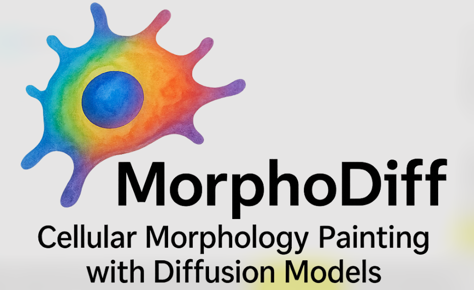

This is the official repository of MorphoDiff, a diffusion based generative pipeline to predict high-resolution cell morphological responses under different conditions based on perturbation encoding.  MorphoDiff is capable of producing guided, high-resolution predictions of cell morphology that generalize across both chemical and genetic interventions.

Link to the ICLR published paper: https://openreview.net/pdf?id=PstM8YfhvI

---

## Environmental Setting

Create a new virtual environment (python 3.10.12 was used in our experiments), and install the diffusers package provided in this repository using the following commands:

```bash
# clone github repository
git clone git@github.com:bowang-lab/MorphoDiff.git

# install diffusers
cd MorphoDiff/morphodiff/diffusers

pip install .

cd examples/text_to_image

pip install -r requirements.txt

# configure accelerator
accelerate config
```

The xformers and wandb (if needed) packages are also required for training and need to be installed in the morphodiff environment. The requirements.txt provides a list of packages and their versions used to run the scripts.

<!-- ## Codebase overview

Code used for data processing, training and validaiton presented in the MorphoDiff manuscript are provided in this repository. Model weights as well as the hyperparameter configuration will be provided publicly upon acceptance.

```bash
├── code
│   ├── bash # Containing (Slurm) bash scripts for training, image generation, and testing generated images
│   ├── cellprofiler # Containing CellProfiler pipelines used for feature extraction, and Python scripts used for feature preprocessing and analysis
│   ├── evaluation # Containing Python scripts for image generation and distance metric calculation
│   ├── preprocessing # Contatinig Python scripts used for data pre-processing
│   ├── cell_cropped_benchmarking_code # Contatinig scripts used for cell-cropped image analysis 
│   ├── required_file # Contatining files required for perturbation encoding of all datasets (perturbation encoded vectors)
│   ├── perturbation_encoder.py # Implementation of perturbation encoding class as part of the MorphoDiff pipeline
│   └── train_text_to_image_cell_painting.py # The modified training script of Stable Diffusion
``` -->

## Training/fine-tuning

The `scripts/train.sh` provides commands for defining parameters required for training MorphoDiff and Stable Diffusion, with description of each parameter provided in the bash script. After defining the parameters of the training script, run the following for submitting the training job using Slurm.

```bash
sbatch scripts/train.sh
```

You should provide a path to a pretrained Stable Diffusion model to the script. It can either be the pretrained Stable Diffusion (such as [stable-diffusion-v1-4](https://huggingface.co/CompVis/stable-diffusion-v1-4) originally used for training MorphoDiff), or one of the pretrained [checkpoints](https://huggingface.co/navidi/MorphoDiff_checkpoints/tree/main).

After the training is completed for the specified number of steps, the `scripts/train.sh` automatically resubmits the job and resumes training from the last checkpoint. You can set the total_steps parameter to not train more than a specific number of steps, or comment the `scontrol requeue $SLURM_JOB_ID` line that resubmits the job once it is finished.

## Data Preparation

Data folder contents must follow the structure described in [https://huggingface.co/docs/datasets/image_dataset#imagefolder](https://huggingface.co/docs/datasets/image_dataset#imagefolder). In particular, a `metadata.jsonl` file must exist to provide the perturbation id for the images. The perturbation ids used in MorphoDiff analysis are provided in the required_file/ folder.

### Download Dataset

The raw datasets used in the MorphoDiff paper can be downloaded from the following websites.

| Dataset       | Link                                                                               |
| ------------- | ---------------------------------------------------------------------------------- |
| RxRx1         | https://www.rxrx.ai/rxrx1                                                          |
| BBBC021       | https://bbbc.broadinstitute.org/BBBC021                                            |
| Rohban et al. | https://github.com/broadinstitute/cellpainting-gallery - (cpg0017-rohban-pathways) |

## Perturbation Encoding

For each dataset, there should be a separate csv file in the required_file/ directory that contains the perturbation id (in the first column, perturbation id must be in the same format as what is provided in the metadata.jsonl), and perturbation embedding with numerical values of the pertubration encoding provided in the following columns. Please look at sample csv files provided.

We used scGPT single-cell foundation model for encoding genetic perturbations (follow installation instruction from https://github.com/bowang-lab/scGPT), and RDKit tool (https://github.com/rdkit/rdkit) for encoding chemical compounds. The code for converting gene ids and SMILES representation of compounds to pertubration embedding is provided in the preprocessing/ folder.

## Image Generation

The `scripts/generate_img.sh` script is a Slurm based bash script that takes the path to the pretrained checkpoint, a file of perturbation list, the number of images to generate per perturbation, and an address to save the images of each perturbation in a separate folder. You should set the parameters described and documented in the `scripts/generate_img.sh` and run it as follow

```bash
sh scripts/generate_img.sh
```

## CellProfiler Analysis

The CellProfiler pipeline used for extracting CellProfiler features is provided in `cellprofiler/pipeline/` folder. All scripts for CellProfiler feature preprocessing, and validation are provided in the `cellprofiler/` folder.

## Citation

If our work assists your research, pls use the following to cite our work:

```bash
@inproceedings{
    navidi2025morphodiff,
    title={MorphoDiff: Cellular Morphology Painting with Diffusion Models},
    author={Zeinab Navidi and Jun Ma and Esteban Miglietta and Le Liu and Anne E Carpenter and Beth A Cimini and Benjamin Haibe-Kains and BO WANG},
    booktitle={The Thirteenth International Conference on Learning Representations},
    year={2025},
    url={https://openreview.net/forum?id=PstM8YfhvI}
}
```
