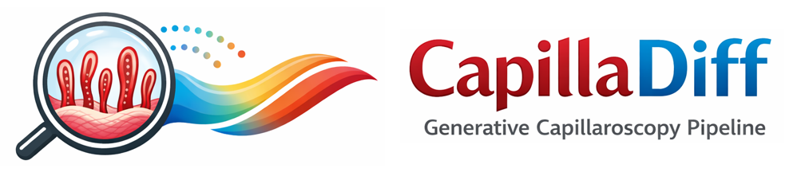

Logo generated with [ChatGPT](https://chatgpt.com)


This is the official repository of CapillaDiff, a diffusion based generative pipeline to predict high-resolution capillaroscopy images with different conditions.

---

## Environmental Setting

Create a new virtual environment (python 3.10.12 was used in our experiments), and install the diffusers package provided in this repository using the following commands:

```bash
# clone github repository
git clone git@github.com:marczuend/CapillaDiff.git

# install diffusers
pip install CapillaDiff/capilladiff/diffusers/.

# install needed libraries
pip install -r CapillaDiff/requirements.txt

# configure accelerator
accelerate config
```

## Needed Models

CapillaDiff requires several pretrained components to function correctly. You must provide paths to these models when running the pipeline. To download the Basemodel as well as the Text Encoders and Evaluation models use the provided download script:
```bash
python3 CapillaDiff/capilladiff/download_models.py
```

### 1. Stable Diffusion Base Model
You need a pretrained **Stable Diffusion checkpoint**, such as [**stable-diffusion-v1-4**](https://huggingface.co/CompVis/stable-diffusion-v1-4), which was originally used for training CapillaDiff.  

### 2. Text Encoder and Tokenizer
CapillaDiff can use **text embeddings** to condition image generation. If you want to use this feature, you must provide local paths to a **CLIPTokenizer** and a **CLIPTextModel**, for example from [**openai/clip-vit-large-patch14**](https://huggingface.co/openai/clip-vit-large-patch14).

### 3. Evaluation Model
For the Evaluation we use the Inception V3 model.

## Recommended folder structure

```bash
MAIN_DIR/
├── CapillaDiff/
│   ├── capilladiff/
│   ├── LICENSE
│   ├── requirments.txt
│   └── README.md
├── metadata/
│   ├── metadata_CapillaDiff_training.csv
│   ├── metadata_CapillaDiff_validation.csv
│   └── metadata_CapillaDiff_test.csv
├── models/
│   ├── capilladiff_checkpoint/
│   ├── clip-vit-large-patch14/
│   └── ...
├── experiments/
│   └── all your trained models
└── generated_images/
    └── all your generated images

```
## Codebase overview

```bash
└── capilladiff/                    # Main codebase for CapillaDiff
    ├── diffusers/                  # Modified diffusers library
    ├── evaluation/                 # Image Generation & Evaluation scripts
    ├── scripts/                    # Training and generation scripts
    │   ├── train.sh                # Script for training CapillaDiff
    │   ├── generate_img.sh         # Script for image generation
    │   └── evaluate_model.sh       # Script for model evaluation (FID, KID)
    ├── CapillaDiff_dataloader.py   # Data loading utilities
    ├── CapillaDiff_encoder.py      # Condition encoding utilities
    ├── download_models.py          # Script to download & restructure required models
    └── train.py                    # Training loop for CapillaDiff
```
## Training/fine-tuning

The `CapillaDiff/capilladiff/scripts/train.sh` provides commands for defining parameters required for training CapillaDiff, with description of each parameter provided in the bash script. After defining the parameters of the training script, run the following for submitting the training job.

```bash
bash CapillaDiff/capilladiff/scripts/train.sh
```

## Data Preparation

One folder should contain all the images for training. The raw datasets used to train CapillaDiff can be found on the LeoMed Cluster (/cluster/work/medinfmk/capillaroscopy/)

The condition for each image should be provided in an extra CSV file (above called metadata/metadata_CapillaDiff_XXX.csv), one for each dataset split (training, validation, test) with the following structure:

```csv
filename,condition1,condition2,...
img_0001.png, 1, ++,...
img_0002.png, 0, 0,...
...
```

## Image Generation

The `CapillaDiff/capilladiff/scripts/generate_img.sh` script is a bash script that takes the path to the pretrained checkpoint, the number of images to generate per condition, and an address to save the images of each condition configuration in a separate folder. You should set the parameters described and documented in the `CapillaDiff/capilladiff/scripts/generate_img.sh` and run it as follow

```bash
bash CapillaDiff/capilladiff/scripts/generate_img.sh
```

## Model Evaluation

The `CapillaDiff/capilladiff/scripts/evaluate_model.sh` script is a bash script that takes the path to the generated images, the path to the reference images, the path to the metadata CSV file for the reference images, and the path to the evaluation model. You should set the parameters described and documented in the `CapillaDiff/capilladiff/scripts/evaluate_model.sh` and run it as follow

```bash
bash CapillaDiff/capilladiff/scripts/evaluate_model.sh
```

## Citation
This respository is based on the work of MorphoDiff from Navidi et al. If you use this codebase please cite the following paper:

```
@inproceedings{
    navidi2025morphodiff,
    title={MorphoDiff: Cellular Morphology Painting with Diffusion Models},
    author={Zeinab Navidi and Jun Ma and Esteban Miglietta and Le Liu and Anne E Carpenter and Beth A Cimini and Benjamin Haibe-Kains and BO WANG},
    booktitle={The Thirteenth International Conference on Learning Representations},
    year={2025},
    url={https://openreview.net/forum?id=PstM8YfhvI}
}
```

